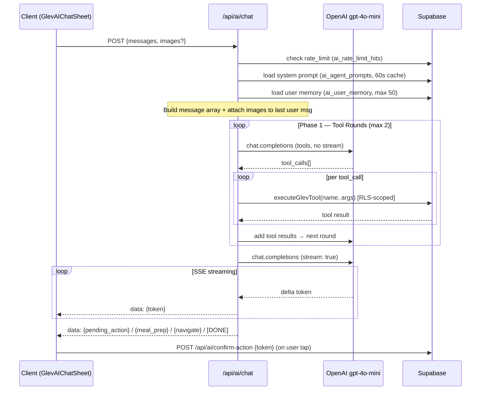
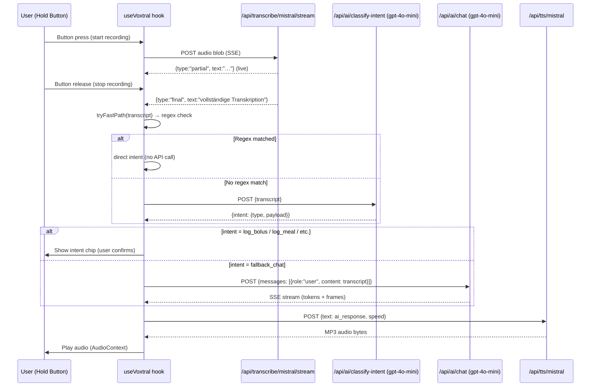
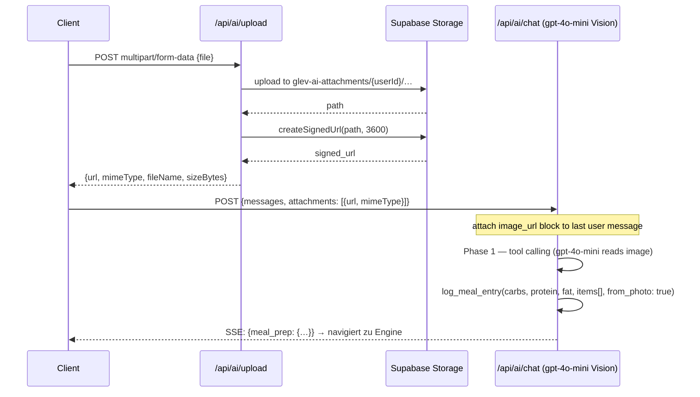

# AI Infrastructure Audit — Glev App

_Stand: 2026-06-20 | Branch: `docs/ai-infrastructure-audit` | Diagnose-only — kein Code verändert_

> **Update 2026-06-20 — nach `feat/llm-consolidation-mistral`:** Alle 5 User-Pipelines (Chat, Voice-Intent, parse-food, chat-macros, Aggregator/Estimate) laufen jetzt auf Mistral (EU). Chat Phase 1 nutzt `mistral-large-2.1` (oder `pixtral-12b-2409` wenn Bild), Phase 2 immer `mistral-large-2.1`. Nutrition-Parsing, Estimate, Intent-Klassifikation und Chat-Macros auf `mistral-small-3`. gpt-5 in chat-macros eliminiert (~100× Cost-Reduction). Rate-Limit (30 req/min) auf parse-food + chat-macros ergänzt.

---

## 0. Executive Summary

Glev betreibt vier separate KI-Pipelines über **zwei Provider** (OpenAI + Mistral AI). Die Split-Architektur ist organisch gewachsen — ursprünglich war Mistral für alles geplant, aber Chat und Nutrition-Parsing landen faktisch bei OpenAI. Die stärksten Handlungsfelder:

| Priorität | Problem | Impact |
|---|---|---|
| 🔴 Kritisch | `gpt-5` in `/api/chat-macros` — teuerstes Modell für Mahlzeit-Korrektur | Kostenspitze |
| 🔴 Kritisch | Kein DB-Logging für AI-Kosten — `logAiUsage()` schreibt nur `console.log` | Kein Cost Visibility |
| 🟠 Hoch | DSGVO: Chat + Nutrition auf OpenAI (US-Server), Voice auf Mistral (EU) — Provider-Split ohne Plan | Compliance-Risiko |
| 🟠 Hoch | Stale Kommentar in `mistralClient.ts` sagt "Mistral powers user-facing chat" — faktisch falsch | Dev Confusion |
| 🟡 Mittel | System-Prompt-Cache ist per Serverless-Instance — bei vielen Vercel Instances kaum Cache-Hits | Latenz + Kosten |
| 🟡 Mittel | `/api/parse-food` und `/api/chat-macros` haben kein Rate-Limiting | Abuse-Vektor |
| 🟢 Niedrig | Intent-Classifier Kommentar: "Mistral classification" — tatsächlich OpenAI | Doku-Fehler |

---

## 1. Provider Map

```
┌─────────────────────────────────────────────────────────────────┐
│  USER-FACING AI PIPELINES                                       │
├────────────────────┬────────────────────────────────────────────┤
│  Pipeline          │  Provider + Modell                        │
├────────────────────┼────────────────────────────────────────────┤
│  Chat (Glev AI)    │  OpenAI  — gpt-4o-mini                   │
│  Vision (in Chat)  │  OpenAI  — gpt-4o-mini (built-in vision) │
│  Intent Class.     │  OpenAI  — gpt-4o-mini                   │
│  Nutrition Parse   │  OpenAI  — gpt-4o-mini                   │
│  Nutrition Estimate│  OpenAI  — gpt-4o-mini                   │
│  Chat Macros ⚠️   │  OpenAI  — gpt-5 (!)                     │
│  STT               │  Mistral — voxtral-mini-latest           │
│  TTS               │  Mistral — voxtral-mini-tts-2603         │
├────────────────────┼────────────────────────────────────────────┤
│  INTERNAL (DevCockpit) │  Mistral — mistral-large-latest      │
└────────────────────┴────────────────────────────────────────────┘
```

**Env Vars:**
- `OPENAI_API_KEY` — direkte OpenAI-Verbindung
- `AI_INTEGRATIONS_OPENAI_API_KEY` + `AI_INTEGRATIONS_OPENAI_BASE_URL` — optionaler Proxy (Replit)
- `MISTRAL_API_KEY` — Mistral STT/TTS + DevCockpit-Fallback
- `MISTRAL_DEV_COCKPIT_API_KEY` — DevCockpit AI (separates Budget)
- `MISTRAL_TTS_MODEL` — Default `voxtral-mini-tts-2603`

---

## 2. Pipeline A — Chat (Glev AI)

### 2.1 Frontend-Dateien

| Datei | Rolle |
|---|---|
| `components/GlevAIChatSheet.tsx` | Chat-UI, SSE-Consumer, Pending-Action-Chips |
| `hooks/useVoxtral.ts` | Hold-to-talk, SSE-STT → Intent → Chat handoff |
| `hooks/useTTS.ts` | Auto-read AI-Antworten, Persona-Leak-Guard |
| `lib/ai/intentClassifier.ts` | Regex-Fast-Path + `/api/ai/classify-intent` |

### 2.2 Route

**`POST /api/ai/chat`** (`app/api/ai/chat/route.ts`)

- Auth: Supabase Cookie-Session (401 wenn kein User)
- Plan-Gate: Glev Smart / Pro / Plus **oder** `feature_flags.ai_voice=true`
- Consent-Gate: `profiles.ai_consent_at` (+ optionale Erweiterungen für Glukose, IOB, History)
- Rate-Limit: 30 Requests / 60 s via Supabase `ai_rate_limit_hits`

**Ablauf (vereinfacht):**
1. System-Prompt aus `ai_agent_prompts` (DB, key=`glev_ai_default`) oder Hardcode-Fallback. 60 s In-Memory-Cache.
2. User-Memory aus `ai_user_memory` (max. 50 Einträge) an System-Prompt angehängt.
3. Bilder (Vision) werden dem letzten User-Message-Block angehängt (Pre-Phase-1).
4. **Phase 1 (Tool-Calling, nicht-streaming):** Max. 2 Runden (`MAX_TOOL_ROUNDS=2`). OpenAI gpt-4o-mini mit `GLEV_TOOLS` (23 Tools). Timeout: 18 s.
5. Tool-Executors laufen serverseitig gegen den authed Supabase-Client (RLS greift).
6. WRITE-Tools erstellen `ai_pending_actions`-Zeile → geben `{ pending_action }` zurück.
7. **Phase 2 (Streaming):** OpenAI gpt-4o-mini, SSE `text/event-stream`.

### 2.3 SSE-Frame-Protokoll

| Frame | Shape | Bedeutung |
|---|---|---|
| `data: {"token":"..."}` | `{token: string}` | Streaming-Token |
| `data: {"pending_action":{...}}` | `PendingActionEnvelope` | Write-Tool bereit zur Bestätigung |
| `data: {"dual_pending_actions":[...]}` | `DualPendingActionEnvelope` | Mahlzeit + Alkohol-Einfluss |
| `data: {"meal_prep":{...}}` | `MealPrepEnvelope` | → Engine-Screen mit Makros vorausfüllen |
| `data: {"navigate":"..."}` | `NavigateEnvelope` | Client navigiert zu Screen |
| `data: {"set_macro":{...}}` | `SetMacroEnvelope` | Formularfeld direkt patchen |
| `data: {"error_code":"..."}` | `{error_code: string}` | Fehler-Code für i18n-Meldung |
| `data: [DONE]` | literal | Stream fertig |

### 2.4 System-Prompt

**Quelle:** DB `ai_agent_prompts` (key=`glev_ai_default`) mit 60 s In-Memory-Cache. Fallback: `lib/ai/glevChatPrompt.ts` (~3500 Zeichen).

**Inhalt-Struktur:**
- Persona: "Du bist Glev, ein KI-Assistent…"
- Compliance-Anker: kein Medizinprodukt, keine Diagnose, Bolus-Redirect-Regel
- Kontext-Snapshot des Users (Glukose, IOB, letzte Mahlzeit, Screen) — inline injiziert pro Request
- User-Memory-Block (bis 50 Key/Value-Einträge)
- READ-Tool-Beschreibungen + Aufrufregeln
- WRITE-Tool-Beschreibungen + Confirmationgate-Regel (D-003)
- Stil-Regeln: kein Markdown, kurze Sätze, Sprache des Users

**Caching:** `lib/ai/systemPromptCache.ts` — 60 s TTL, **modulebezogen pro Serverless-Instance**. Bei vielen Vercel-Instances kaum Cache-Hits.

### 2.5 Tool-Calling (23 Tools)

**READ-Tools (keine DB-Schreibvorgänge):**
- `get_glucose_status` — aktueller CGM-Wert
- `get_glucose_history` — Aggregat (Avg/Min/Max/TiR) für period enum
- `get_active_iob` — IOB-Berechnung aus `insulin_logs` + `meals`
- `get_meal_history` — letzte Mahlzeiten (limit, hour_from/to)
- `get_bolus_history` — letzte Bolus-Dosen
- `get_basal_status` — letzte Basal-Dosis + konfiguriertes Präparat
- `get_appointments` — gespeicherte Arzttermine
- `get_check_history` — Post-Bolus-Checks mit BZ-Wert

**WRITE-Tools (Pending-Action-Pattern):**
- `log_meal_entry` → `meal_prep` SSE-Frame (→ Engine) oder `pending_action`
- `log_bolus_entry` / `log_basal_entry` / `log_insulin` (unified) → `pending_action`
- `log_fingerstick` → `pending_action`
- `log_exercise_entry` → `pending_action`
- `log_symptom_entry` → `pending_action`
- `log_influence_entry` → `pending_action` (Alkohol: Dual-Emission wenn auch Mahlzeit)
- `log_cycle_entry` → `pending_action`
- `add_appointment` → `pending_action`
- `add_timeline_check` → `pending_action`
- `update_setting` → `pending_action`
- `submit_structured_feedback` → `pending_action`
- `save_user_observation` → direkt in `ai_user_memory` (kein Pending-Gate)
- `set_macro` → `set_macro` SSE-Frame (Client-seitiges Formular-Patch, kein DB)
- `navigate_to` → `navigate` SSE-Frame

**Confirmation-Flow:** Pending-Action → SSE-Frame an Client → User tippt auf Chip → `POST /api/ai/confirm-action {token}` → eigentlicher DB-Insert.

### 2.6 Sequence Diagram



---

## 3. Pipeline B — Voice (STT + Intent + TTS)

### 3.1 Frontend-Dateien

| Datei | Rolle |
|---|---|
| `hooks/useVoxtral.ts` | Hold-to-talk, Mikrofon-Recording, SSE-STT |
| `lib/ai/intentClassifier.ts` | Regex Fast-Path + gpt-4o-mini Klassifikation |
| `hooks/useTTS.ts` | TTS-Playback (Mistral Primary, Web Speech Fallback) |
| `GlevAIChatSheet.tsx` | UI-Integration, Intent-Routing nach Klassifikation |

### 3.2 Routes

| Route | Modell | Zweck |
|---|---|---|
| `POST /api/transcribe/mistral` | `voxtral-mini-latest` | Batch STT, gibt `{text}` zurück |
| `POST /api/transcribe/mistral/stream` | `voxtral-mini-latest` | SSE-STT, `{type:"partial"}` + `{type:"final"}` |
| `POST /api/tts/mistral` | `voxtral-mini-tts-2603` | TTS, gibt MP3-Bytes zurück |
| `POST /api/ai/classify-intent` | `gpt-4o-mini` | Intent-Klassifikation (Fallback nach Regex) |

### 3.3 STT — Ablauf

**Hold-to-Talk:** Mikrofon aktiv solange Button gedrückt.

**SSE-Primärpfad** (`/api/transcribe/mistral/stream`):
- Partial-Transkripte während Aufnahme
- Final-Transkript bei Release → Intent-Klassifikation

**Batch-Fallback** (`/api/transcribe/mistral`):
- Nach `STT_TIMEOUT_MS=20000` oder wenn SSE-Stream fehlschlägt
- Gibt einmalig `{text}` zurück

**Rate-Limit:** `lib/ai/sttRateLimiter.ts` (separate Limit-Klasse, nicht Supabase-basiert)

**Auth:** Supabase Cookie-Session. Min. Blob-Size-Check (verhindert Null-Audio-Requests).

### 3.4 Intent-Klassifikation

**Zwei-Stufen-Approach:**

**Stufe 1 — Regex Fast-Path** (< 1 ms, kein API-Call):
- Bolus-Pattern: `^(\d+(?:[.,]\d+)?)\s*(ie|einheit(?:en)?|units?|u\b)` → `log_bolus`
- Navigate-Pattern: `(?:geh?|öffne?|zeig|go to|open)\s+(?:zu\s+|nach\s+)?(dashboard|entries|…)` → `navigate`

**Stufe 2 — gpt-4o-mini** (bei kein Regex-Match, ~500 ms):
- Inline-Prompt in `classify-intent/route.ts` (~50 Zeilen)
- 7 Intent-Typen: `log_bolus`, `log_meal`, `log_exercise`, `log_symptom`, `edit_macro`, `navigate`, `fallback_chat`
- `max_tokens: 150`, `temperature: 0.1`, `response_format: json_object`
- Fehler → immer `fallback_chat` (niemals 5xx propagiert)

> **Stale Kommentar:** `intentClassifier.ts` Zeile 9 sagt "Mistral classification" — tatsächlich OpenAI.

### 3.5 TTS — Ablauf

**Primärpfad:** `POST /api/tts/mistral` → Mistral API → MP3-Bytes → `HTMLAudioElement` + `AudioContext`

**Playback-Rates:** slow=1.0, normal=1.25, fast=1.55 (Voxtral-Cadence ist langsam, daher Base-Rate 1.25)

**iOS/Capacitor:** AudioContext wird beim ersten User-Gesture unlocked. Autoplay danach erlaubt (Capacitor `requiresUserActionForMediaPlayback=false`).

**Persona-Leak-Guard** (`extractAssistantText` in `useTTS.ts`):
- Filtert Zeilen die System-Prompt-Fingerabdrücke enthalten (8 Nuclear-Strings + ~60 Prefix-Patterns)
- Cap: 600 Zeichen max. für TTS
- Schutz vor versehentlichem Vorlesen interner Instruktionen

**Fallback:** Web Speech API (`SpeechSynthesisUtterance`, `de-DE`), greift bei TTS-Fehler oder Timeout (12 s).

### 3.6 Sequence Diagram



---

## 4. Pipeline C — Vision (Foto-Mahlzeit-Analyse)

### 4.1 Architektur

Vision ist **keine separate Pipeline** — es ist ein Attachment-Layer über der Chat-Pipeline.

Ablauf:
1. User wählt/fotografiert Bild in der Chat-UI
2. Client postet Bild an `POST /api/ai/upload`
3. Server speichert in Supabase Storage (`glev-ai-attachments/{userId}/{yyyy-mm}/{uuid}`)
4. Signed URL (1 h gültig) wird zurückgegeben
5. Client hängt URL + mimeType als `image_url`-Block an die nächste Chat-Message
6. Chat-Route erkennt Bild-Attachment, hängt es an den letzten User-Message-Block (vor Phase 1)
7. gpt-4o-mini interpretiert das Bild (Vision built-in) → ruft `log_meal_entry` Tool

### 4.2 Upload-Route

**`POST /api/ai/upload`** (`app/api/ai/upload/route.ts`)

- Auth: Supabase Cookie-Session
- Max: 5 MB
- Erlaubte MIME-Typen: `image/jpeg`, `image/png`, `image/heic`, `image/webp`, `application/pdf`
- Storage: `glev-ai-attachments` bucket, Pfad `{userId}/{yyyy-mm}/{uuid}-{filename}`
- Response: `{url, mimeType, fileName, sizeBytes}` (url = Signed URL, 1 h gültig)
- RLS: Bucket-Policy scoped auf eigenen User-Folder

### 4.3 Sequence Diagram



### 4.4 Vision-Einschränkungen

- Kein separater Vision-Endpunkt — immer über Chat-Context
- PDF wird als Text prepended (kein native PDF-Vision)
- HEIC wird akzeptiert (Supabase Storage agnostisch), aber OpenAI konvertiert intern
- 5 MB Limit, 1-h Signed URL (expired URLs → Chat-Fehler)

---

## 5. Pipeline D — Nutrition Aggregator

### 5.1 Architektur

Zwei-Stufen-Pipeline: **GPT-Parser** → **Smart-Routing-Aggregator**

Trigger: Freiform-Texteingabe oder Voice-Intent `log_meal` im Engine-Screen (nicht im Chat — Chat nutzt Tool `log_meal_entry` direkt).

### 5.2 Routes

| Route | Datei | Modell/Quelle |
|---|---|---|
| `POST /api/parse-food` | `app/api/parse-food/route.ts` | Orchestriert Pipeline |
| — Stage 1 | `lib/nutrition/parseFood.ts` | OpenAI gpt-4o-mini |
| — Stage 2 | `lib/nutrition/aggregate.ts` | OFF / USDA / gpt-4o-mini / User History |
| — GPT-Fallback | `lib/nutrition/estimate.ts` | OpenAI gpt-4o-mini |
| `POST /api/chat-macros` | `app/api/chat-macros/route.ts` | OpenAI **gpt-5** ⚠️ |

### 5.3 Stage 1 — GPT-Parser (`parseFood.ts`)

- Modell: `gpt-4o-mini`
- Timeout: 6 s
- Input: freier Mahlzeit-Text (de/en) + locale
- Output: strukturiertes Array mit Items (Name, Gramm, Suchbegriffe bilingua)
- Prompt: ~210 Token System-Prompt + Strict JSON Schema
- T1D Safety Contract: wirft bei Fehler (keine stillen Null-Werte)

### 5.4 Stage 2 — Aggregator (`aggregate.ts`)

**Quell-Priorität (per Item, parallel via `Promise.all`):**

```
1. User History (≥3 Vorkommen ODER user_confirmed)  → nutritionSource: "user_history"
2. Open Food Facts + USDA race (Promise.any)          → nutritionSource: "open_food_facts" / "usda"
3. GPT-Estimate (estimate.ts, 4s timeout)             → nutritionSource: "estimated"
4. Category Default (meal_type-basiert)               → nutritionSource: "database"
5. Unknown (0-Wert, niemals stillschweigend)          → nutritionSource: "unknown"
```

**Top-Level `nutritionSource`:** `database` | `mixed` | `estimated` (aggregiert über alle Items)

### 5.5 Chat-Macros (`chat-macros/route.ts`)

- Modell: **`gpt-5`** ⚠️ (höchstes und teuerstes verfügbares OpenAI-Modell)
- Funktion: Re-Aggregation nach Chat-Korrektur ("die Pasta hatte mehr Fett")
- Auth: Best-effort (kein Auth-Fehler wird propagiert)
- Kein Rate-Limiting

### 5.6 Sequence Diagram

```mermaid
sequenceDiagram
    participant C as Client (Engine Screen)
    participant PF as /api/parse-food
    participant GPT1 as gpt-4o-mini (parseFood)
    participant AGG as Aggregator
    participant UH as User History (Supabase)
    participant OFF as Open Food Facts API
    participant USDA as USDA FoodData API
    participant GPT2 as gpt-4o-mini (estimate)

    C->>PF: POST {text, locale}
    PF->>GPT1: structured-output parse
    GPT1-->>PF: [{name, grams, searchTerms}]
    PF->>UH: lookupUserFoodHistory (best-effort)
    UH-->>PF: user history map

    loop per item (parallel)
        alt User History hit (≥3 or confirmed)
            AGG-->>PF: source: user_history
        else
            AGG->>OFF: search (race)
            AGG->>USDA: search (race)
            alt first response wins
                AGG-->>PF: source: open_food_facts | usda
            else both fail/timeout
                AGG->>GPT2: estimate macros (4s timeout)
                GPT2-->>AGG: {carbs, protein, fat, fiber}
                AGG-->>PF: source: estimated
            end
        end
    end

    PF-->>C: {items, totals, nutritionSource, mealType, summary}
```

---

## 6. Cost Drivers & Schätzungen

### Modell-Preise (Stand 2026-06)

| Modell | Input $/1M | Output $/1M |
|---|---|---|
| gpt-4o-mini | 0.15 | 0.60 |
| gpt-5 | ~15.00 | ~60.00 |
| voxtral-mini-latest (STT) | ~0.004/min Audio | — |
| voxtral-mini-tts-2603 (TTS) | — | ~0.015/1k chars |
| mistral-large-latest | 2.00 | 6.00 |

### Kosten-Schätzung: Chat-Pipeline

**Annahmen:**
- System-Prompt: ~900 Token (3500 chars ≈ 875 tok + User-Memory ~100 tok)
- Durchschn. User-Message: ~50 Token
- Tool-Round: ~800 Token (GET-tool Resultate kompakt)
- Phase-2-Output: ~250 Token
- 3 Chat-Nachrichten/User/Tag im Schnitt

**Pro Chat-Turn (kein Tool):**
- Input: ~950 Token × 2 (Phase 1 + Phase 2) = ~1900 Token
- Output: ~250 Token
- Kosten: (1900 × 0.15 + 250 × 0.60) / 1M = $0.000435

**Pro Chat-Turn (1 Tool-Round):**
- Input: ~2700 Token
- Output: ~300 Token
- Kosten: ~$0.00059

| Nutzer | Turns/Tag | Monat-Kosten Chat |
|---|---|---|
| 100 | 3 | ~$0.14 |
| 1.000 | 3 | ~$1.44 |
| 10.000 | 3 | ~$14.40 |

### Kosten-Schätzung: Nutrition-Parsing

**Pro Parse-Anfrage:**
- Stage 1 (gpt-4o-mini): ~400 Token Input, ~200 Token Output → $0.0001
- Stage 2 GPT-Estimate (wenn OFF/USDA miss): ~300 Token Input, ~150 Token Output → $0.0001
- Nehme 40% Estimate-Rate an

**Pro Mahlzeit: ~$0.00014**

| Nutzer | Mahlzeiten/Tag | Monat-Kosten Nutrition |
|---|---|---|
| 100 | 3 | ~$0.13 |
| 1.000 | 3 | ~$1.26 |
| 10.000 | 3 | ~$12.60 |

### Kosten-Schätzung: Voice

**STT pro Aufnahme (avg 5 s Audio → 0.083 min):**
- Mistral voxtral-mini: ~$0.004/min → $0.00033 pro Aufnahme

**TTS pro Antwort (avg 200 Zeichen):**
- ~$0.015/1k chars → $0.003 pro TTS

**Intent-Classify (wenn kein Regex-Match, ~30%):**
- gpt-4o-mini: 50 Input + 30 Output Token → $0.000026

**Pro Voice-Interaction: ~$0.0034**

| Nutzer | Voice-Ints/Tag | Monat-Kosten Voice |
|---|---|---|
| 100 | 5 | ~$0.51 |
| 1.000 | 5 | ~$5.10 |
| 10.000 | 5 | ~$51.00 |

### ⚠️ Chat-Macros: gpt-5 Kostenspitze

**gpt-5 ist ~100× teurer als gpt-4o-mini.**

Pro chat-macro Request: ~800 Input + 400 Output Token
- Mit gpt-5: (800 × 15 + 400 × 60) / 1M = $0.036 pro Request
- Mit gpt-4o-mini: $0.00036 pro Request

Bei 1.000 Nutzern und 1 Korrektur/Woche: **$5.14/Monat vs. $0.05** — Faktor 100.

---

## 7. Risk Register

| # | Risiko | Wahrscheinlichkeit | Impact | Priorität |
|---|---|---|---|---|
| R1 | gpt-5 in chat-macros verursacht 100× Kostensteigerung gegenüber gpt-4o-mini | Hoch (bereits aktiv) | Hoch | 🔴 |
| R2 | Keine DB-Persistenz für AI-Kosten — `logAiUsage()` = nur console.log; kein Alerting | Hoch | Hoch | 🔴 |
| R3 | DSGVO: Chat-Konversationen (inkl. BZ-Daten) gehen an OpenAI US-Server | Mittel | Hoch | 🔴 |
| R4 | Stale Kommentar in mistralClient.ts täuscht künftige Entwickler | Hoch | Mittel | 🟠 |
| R5 | Kein Rate-Limit auf /api/parse-food und /api/chat-macros | Mittel | Mittel | 🟠 |
| R6 | System-Prompt-Cache ist per Serverless-Instance (kein shared Redis) — ineffektiv bei vielen Instanzen | Hoch | Niedrig | 🟡 |
| R7 | Signed URLs für Vision-Attachments expiren nach 1 h — Retry nach 1 h schlägt fehl | Niedrig | Mittel | 🟡 |
| R8 | STT-Fallback (batch) hat keinen Retry — bei Flaky-Netz stummes Scheitern | Mittel | Niedrig | 🟡 |
| R9 | Intent-Classify-Kommentar ("Mistral") irreführend — tatsächlich OpenAI | Hoch | Niedrig | 🟢 |

---

## 8. Extension Points

### 8.1 EU-Konsolidierung auf Mistral

**Was zu ändern wäre:**
- `app/api/ai/chat/route.ts`: `getOpenAIClient()` → `getMistralClient()` + Mistral-SDK-Format für Tool-Calling
- `app/api/ai/classify-intent/route.ts`: OpenAI-Client → Mistral-Client
- `lib/nutrition/parseFood.ts`: OpenAI-Client → Mistral (pixtral oder mistral-small für Nutrition-Parsing)
- `lib/nutrition/estimate.ts`: OpenAI → Mistral (mistral-small-latest?)
- `app/api/chat-macros/route.ts`: gpt-5 → mistral-medium (oder entfernen)
- Evaluation: Mistral-Tool-Calling vs. OpenAI (kleine API-Unterschiede in Tool-Format)
- System-Prompt: prüfen ob deutsche Anweisungen mit Mistral-Modellen gleich gut funktionieren

**Vorteil:** Alle User-Daten bleiben auf EU-Servern (DSGVO). Single-Vendor für alle User-Pipelines.

**Risiko:** Mistral gpt-4o-mini Äquivalent ist mistral-small-latest — Qualitätsvergleich notwendig.

### 8.2 Mistral Vision Switch

**Aktuell:** gpt-4o-mini mit built-in Vision für Foto-Mahlzeit-Analyse

**Alternative:** Mistral `pixtral-12b-2409` (12B Vision-Modell, EU-seitig)

**Änderung:** In `app/api/ai/chat/route.ts` Vision-Zweig: wenn Attachment erkannt, separaten pixtral-Call für Bild-Analyse machen, Resultat in Chat-Context injizieren.

**Oder:** Mittelfristig, wenn Mistral sein Large-Modell mit Vision ausstattet, direkt im Chat.

### 8.3 Offline-LLM / Local Model Layer

**Kandidaten für lokales Modell (On-Device oder Edge):**
1. **Intent-Klassifikation:** Regex-Fast-Path bereits vorhanden. Offline-Erweiterung: kleines ONNX-Modell (z.B. DistilBERT fine-tuned auf ~1000 Intent-Beispiele) — kein API-Call, < 50 ms, 0 Kosten.
2. **Nutrition-Estimate-Fallback:** Offline-Datenbank (Bundeszentrum für Ernährung BZfE) als Tier-0 vor OFF/USDA — reduziert API-Calls für häufige DE-Lebensmittel.
3. **TTS Offline:** Apple AVSpeechSynthesizer direkt im Capacitor-Layer als letzter Fallback (bereits als Web-Speech-Fallback im Browser, könnte auch als Capacitor-Plugin kommen).

**Integration-Punkt:** `lib/ai/intentClassifier.ts` `tryFastPath()` — eine dritte Stage vor dem API-Call.

### 8.4 Lokaler Food-DB-Cache

**Aktuell:** OFF/USDA-Lookup bei jeder Anfrage ohne Caching.

**Erweiterung:** Redis/Upstash-Cache mit 24 h TTL für häufige Items.
- Kandidaten: Top-100 DE-Lebensmittel (Brot, Haferflocken, Apfel, Pasta, Reis, …)
- Cache-Key: `food:${normalizedName}:${locale}`
- Erwartete Hit-Rate: ~40% der Anfragen (nach Pareto)
- Kosten-Einsparung: 40% weniger OFF/USDA-Requests

**Integration-Punkt:** `lib/nutrition/aggregate.ts` vor `Promise.any([offLookup, usdaLookup])`.

### 8.5 DB-basiertes AI Usage Logging

**Aktuell:** `lib/ai/aiUsageLog.ts` → nur `console.log`. Keine Datenbank, kein Alerting.

**Erweiterung:**
```sql
CREATE TABLE ai_usage_logs (
  id uuid DEFAULT gen_random_uuid() PRIMARY KEY,
  user_id uuid REFERENCES auth.users,
  source text NOT NULL,       -- 'glev_user' | 'meal_analysis' | 'voice' | 'dev_cockpit'
  model text NOT NULL,
  operation text,
  ok boolean NOT NULL,
  prompt_tokens integer,
  completion_tokens integer,
  total_tokens integer,
  cost_usd numeric(10,6),
  ms integer,
  created_at timestamptz DEFAULT now()
);
```

**Integration:** `logAiUsage()` → Supabase-Insert (fire-and-forget via `after()` in Vercel).

---

## 9. Empfehlungen

### 9.1 Sofort (< 1 Sprint)

1. **gpt-5 → gpt-4o-mini in `/api/chat-macros`**: Identische Qualität für Macro-Korrektur, 100× günstiger. Einzeilige Änderung.

2. **Stale Kommentare fixen:**
   - `lib/ai/mistralClient.ts`: "Mistral powers the user-facing Glev AI chat" → richtigstellen
   - `lib/ai/intentClassifier.ts` Zeile 9: "Mistral classification" → "OpenAI gpt-4o-mini classification"

3. **Rate-Limit auf `/api/parse-food` und `/api/chat-macros`**: Gleiche `ai_rate_limit_hits`-Logik wie in `/api/ai/chat`.

### 9.2 Kurzfristig (1-2 Sprints)

4. **DB-basiertes AI Usage Logging**: Supabase-Tabelle `ai_usage_logs` + `logAiUsage()` auf DB-Insert umstellen. Prerequisite für alle Cost-Visibility-Features.

5. **System-Prompt-Cache**: Ggf. auf Supabase KV / Upstash Redis umstellen für instanz-übergreifendes Caching. Alternativ: TTL auf 300 s erhöhen (akzeptabler für Admin-Workflow).

### 9.3 Mittelfristig (Roadmap)

6. **EU-Konsolidierung auf Mistral**: Alle User-facing-Pipelines (Chat, Vision, Nutrition, Intent) auf Mistral migrieren → DSGVO-konform, Single-Vendor, Budget-transparent. Qualitäts-A/B-Test empfohlen vor Migration.

7. **Lokaler Food-DB-Cache**: Redis/Upstash mit Top-DE-Lebensmitteln — direkte Kosten- und Latenz-Reduktion für Nutrition-Aggregator.

8. **Offline-Intent-Klassifikation**: Kleines ONNX-Modell für die häufigsten Intent-Typen (log_meal, log_bolus, navigate) — 0 API-Kosten, < 50 ms, funktioniert offline.

### 9.4 Architektur-Empfehlung: Ziel-State

```
Nach EU-Konsolidierung:

User-Facing:          Mistral small-latest (Chat + Nutrition + Intent)
Vision (Fotos):       Mistral pixtral-12b (oder Mistral Vision wenn verfügbar)
STT:                  Mistral voxtral-mini-latest  [bereits EU]
TTS:                  Mistral voxtral-mini-tts-2603 [bereits EU]
Intent Fast-Path:     Regex + ONNX-Offline (kein API-Call)
Food DB Cache:        Upstash Redis (24 h TTL, Top-DE-Items)
Usage Logging:        Supabase ai_usage_logs
DevCockpit:           Mistral large-latest         [bereits so]
```

Einziger Provider-Verbleib bei OpenAI: ggf. `gpt-5` oder `gpt-4o` für spezifische High-Quality-Tasks wenn Mistral-Äquivalent nicht ausreicht.

---

## Anhang: Datei-Index

| Datei | Pipeline | Rolle |
|---|---|---|
| `app/api/ai/chat/route.ts` | Chat | Haupt-Endpunkt, Tool-Loop, SSE |
| `app/api/ai/classify-intent/route.ts` | Voice | Intent-Klassifikation (gpt-4o-mini) |
| `app/api/ai/upload/route.ts` | Vision | Bild-Upload → Supabase Storage |
| `app/api/ai/confirm-action/route.ts` | Chat | Pending-Action bestätigen → DB-Write |
| `app/api/transcribe/mistral/route.ts` | Voice | Batch STT |
| `app/api/transcribe/mistral/stream/route.ts` | Voice | SSE STT |
| `app/api/tts/mistral/route.ts` | Voice | TTS |
| `app/api/parse-food/route.ts` | Nutrition | Orchestriert 2-Stufen-Pipeline |
| `app/api/chat-macros/route.ts` | Nutrition | Mahlzeit-Korrektur (gpt-5 ⚠️) |
| `lib/ai/glevTools.ts` | Chat | 23 Tool-Definitionen + Executors |
| `lib/ai/glevChatPrompt.ts` | Chat | Hardcode-Fallback System-Prompt |
| `lib/ai/openaiClient.ts` | Chat/Nutrition | OpenAI-Client-Factory |
| `lib/ai/mistralClient.ts` | Voice/DevCockpit | Mistral-Client-Factory |
| `lib/ai/intentClassifier.ts` | Voice | Regex + API Intent-Klassifikation |
| `lib/ai/systemPromptCache.ts` | Chat | In-Memory-Cache 60 s |
| `lib/ai/aiUsageLog.ts` | All | Strukturiertes Logging (console only!) |
| `lib/nutrition/parseFood.ts` | Nutrition | GPT-Parser Stage 1 |
| `lib/nutrition/aggregate.ts` | Nutrition | Smart-Router Stage 2 |
| `lib/nutrition/estimate.ts` | Nutrition | GPT-Estimate Fallback |
| `hooks/useVoxtral.ts` | Voice | Hold-to-Talk, SSE-Consumer |
| `hooks/useTTS.ts` | Voice | TTS-Playback, Persona-Leak-Guard |
